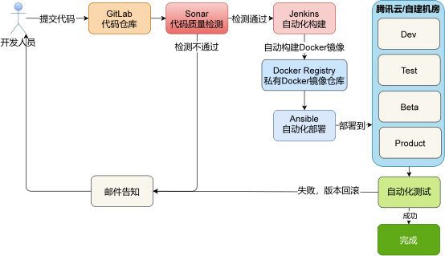
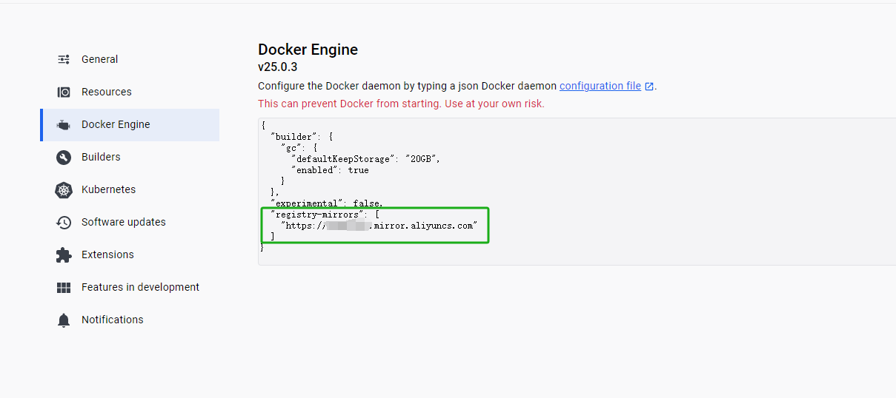
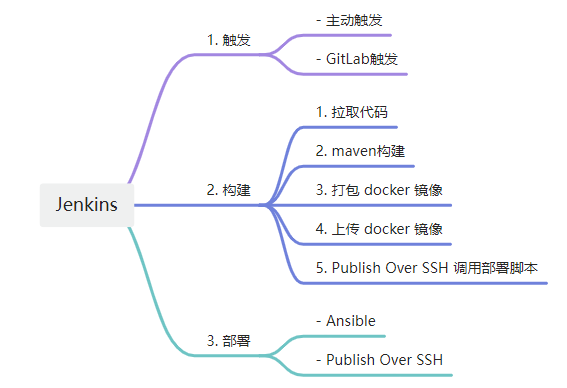

# 持续集成



## 环境准备

### Docker 安装
https://www.docker.com/products/docker-desktop/
### Docker 镜像源设置

aliyun镜像地址: [容器镜像服务 (aliyun.com)](https://cr.console.aliyun.com/cn-hangzhou/instances/mirrors)



### 镜像文件拉取

```shell
docker pull gitlab/gitlab-ce:latest

docker pull jenkins/jenkins:lts-jdk17
```

### 安装 GitLab

> 参考网址 ： [Install GitLab using Docker | GitLab](https://docs.gitlab.com/ee/install/docker.html)

#### docker-compose.yaml

```yaml
version: '3.6'
services:
  gitlab:
    image: gitlab/gitlab-ce:latest
    container_name: gitlab
    restart: always
    hostname: 'localhost'
    environment:
      GITLAB_OMNIBUS_CONFIG: |
        # Add any other gitlab.rb configuration here, each on its own line
        external_url 'http://localhost:9080'
        gitlab_rails['gitlab_shell_ssh_port'] = 9022
    ports:
      - '9080:9080'
      - '9043:9043'
      - '9022:9022'
    volumes:
      - D:/Space/software/docker-data/gitlab/config:/etc/gitlab
      - D:/Space/software/docker-data/gitlab/logs:/var/log/gitlab
      - D:/Space/software/docker-data/gitlab/data:/var/opt/gitlab
    shm_size: '256m'
```

#### Gitlab 启动与访问

```shell
# 1. docker compose 启动
docker compose up -d

# 2. 获取gitlab启动密码
docker exec -it gitlab grep 'Password:' /etc/gitlab/initial_root_password

# 3. 访问 gitlab
http://localhost:9080
username: root
password: 步骤2中获取到的密码
```

### 安装 Jenkins

> 参考文档 ： [docker/README.md at master · jenkinsci/docker · GitHub](https://github.com/jenkinsci/docker/blob/master/README.md)

#### docker-compose.yaml

```yaml
  jenkins:
    image: 'jenkins/jenkins:lts-jdk17'
    container_name: jenkins
    restart: always
    environment:
      - TZ=Asia/Shanghai
    ports:
      - '9020:8080'
      - '9021:50000'
    volumes:
      - D:/Space/software/docker-data/jenkins/jenkins_home:/var/jenkins_home
      - D:/Space/software/docker-data/jenkins/docker.sock:/var/run/docker.sock
      - D:/Space/software/docker-data/jenkins/docker:/usr/bin/docker
```

#### Jenkins 初始化

```shell
# 1. 访问
http://localhost:9020

# 2. 根据页面提示登陆并初始化
```

### 完整 docker-compose.yaml

```yaml
version: '3.6'
services:

  gitlab:
    image: gitlab/gitlab-ce:latest
    container_name: gitlab
    restart: always
    hostname: 'localhost'
    environment:
      GITLAB_OMNIBUS_CONFIG: |
        # Add any other gitlab.rb configuration here, each on its own line
        external_url 'http://localhost:9080'
        gitlab_rails['gitlab_shell_ssh_port'] = 9022
    ports:
      - '9080:9080'
      - '9043:9043'
      - '9022:9022'
    volumes:
      - D:/Space/software/docker-data/gitlab/config:/etc/gitlab
      - D:/Space/software/docker-data/gitlab/logs:/var/log/gitlab
      - D:/Space/software/docker-data/gitlab/data:/var/opt/gitlab
    shm_size: '256m'

  jenkins:
    image: 'jenkins/jenkins:lts-jdk17'
    container_name: jenkins
    restart: always
    environment:
      - TZ=Asia/Shanghai
    ports:
      - '9020:8080'
      - '9021:50000'
    volumes:
      - D:/Space/software/docker-data/jenkins/jenkins_home:/var/jenkins_home
      - D:/Space/software/docker-data/jenkins/docker.sock:/var/run/docker.sock
      - D:/Space/software/docker-data/jenkins/docker:/usr/bin/docker

```

## Jenkins 构建流程




